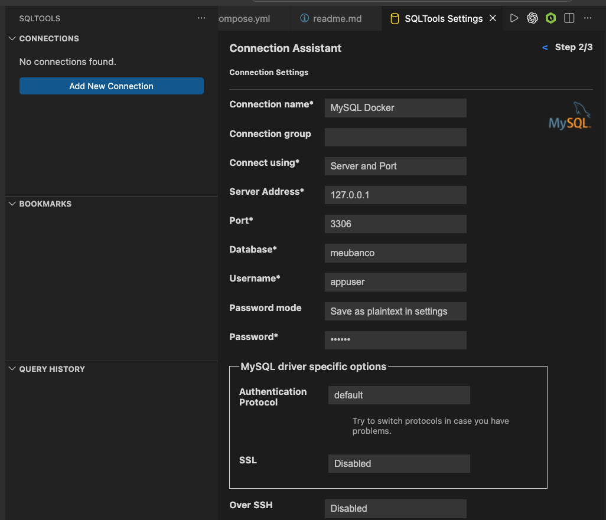
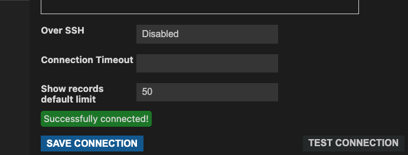
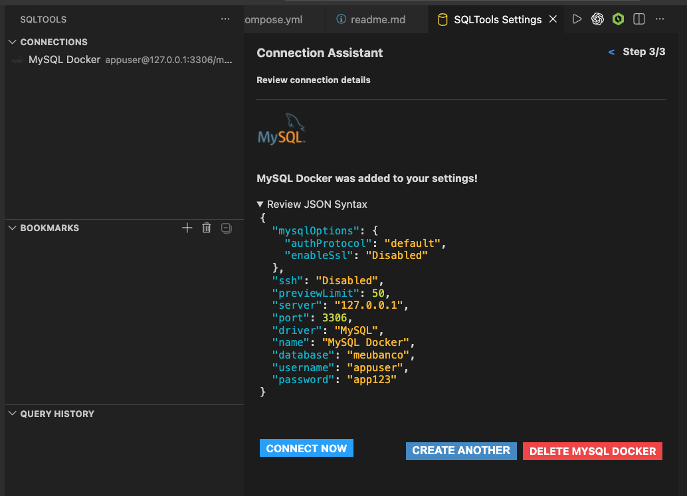

# notas da conexão via vscode

- docker compose up -d

- docker logs meu-mysql

- docker compose down

- docker compose down -v

- docker compose up -d

## porta ocupada

ports:
  - "3307:3306"

## vscode extenção

- SQLTools
- SQLTools MySQL/MariaDB Driver

## exemplo de como preencher

